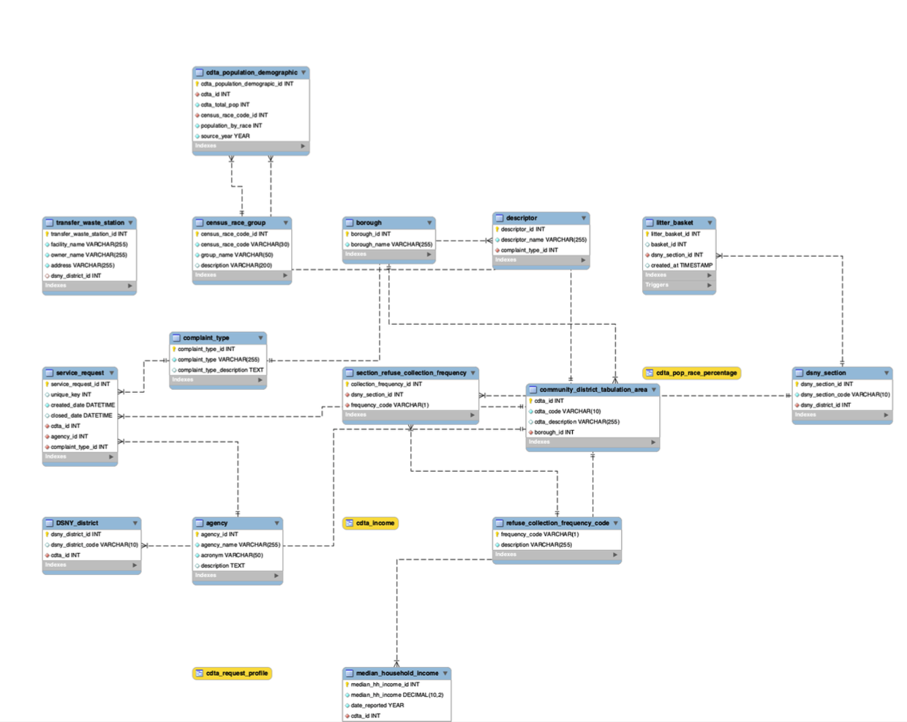

- `CleanCityNYC_database_dump.sql` – Full dump including schema and sample data.
- `logical_erd_CleanCityNYC.png` – Entity-relationship diagram of the database in the 3rd normal form.
# CleanCityNYC

CleanCityNYC is a MySQL database project exploring the relationship between NYC community district demographics, 
sanitation infrastructure, and 311 complaint data.

## Files Included

- `CreateAndQuery_CleanCityNYC_database.sql` – SQL script for creating the database structure and some basic queries.
- `mySQL_CleanCityNYC_database_dump.sql` – Full dump including schema and sample data.
- `logical_erd_cleancitynyc.png` – Entity-relationship diagram of the database.

## Entity-Relationship Diagram

